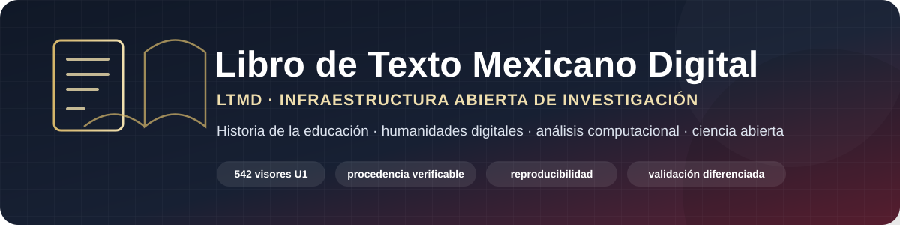

<p align="center">
  
</p>

<p align="center">
  <strong>Open research infrastructure for the longitudinal study of Mexican textbooks through history of education, digital humanities, computational analysis, and open science.</strong><br>
  <sub>Document identity · SHA-256 integrity · OCR · segmentation · documentary dependence · human validation · reproducibility</sub>
</p>

<p align="center">
  <a href="https://github.com/fersandovalgtz/libro-texto-mexicano-digital/releases/tag/v0.1.0-rc.1"></a>
  <a href="CITATION.cff"></a>
  <a href="codemeta.json"></a>
  <a href="FAIR_ASSESSMENT.md"></a>
  <a href="LICENSE"></a>
  <a href="DATA_LICENSE.md"></a>
</p>

<p align="center">
  <a href="https://github.com/fersandovalgtz/libro-texto-mexicano-digital/actions"></a>
  
  
  
  
</p>

<p align="center"><a href="README.md">Español</a> · <a href="FAIR_ASSESSMENT.md">FAIR</a> · <a href="GOVERNANCE.md">Governance</a> · <a href="PROVENANCE.md">Provenance</a> · <a href="CONTRIBUTING.md">Contributing</a></p>

## What LTMD is

**Libro de Texto Mexicano Digital (LTMD)** is a research infrastructure for building a traceable historical-computational corpus of Mexican textbooks and studying long-term transformations in curriculum, pedagogical language, school activities, values, social representations, and visual resources.

The project keeps **document identity**, **asset resolution**, **technical processing**, **derived data**, **human validation**, and **historical interpretation** as distinct layers of evidence.

> [!IMPORTANT]
> `corpus_ready` does **not** mean `semantic_ready`. Technical completion can be reproducible and complete within its declared scope without constituting human-validated semantic evidence.

## Scientific status

Reference cut: **17 August 2026**.

| Indicator | Status |
|---|---:|
| LTMD-U1 historical universe | **542 / 542 viewers inventoried** |
| Closed or resolved technical coverage | **329 / 542 (60.70%)** |
| Canonical processing objects | **298 / 542 (54.98%)** |
| Human semantic validation | **0 / 542** |
| Published methodological release | **v0.1.0-rc.1** |
| LTMD DOI | **pending; not pre-declared** |

## Evidence architecture

```text
institutional catalog
        ↓
document identity / viewer_key / book_id
        ↓
asset resolution + SHA-256
        ↓
temporary OCR
        ↓
PAGESTRUCT
        ↓
FRAGSEG
        ↓
metadata, relations, and hashes
        ↓
human validation of the construct
        ↓
validated classification
        ↓
historical analysis
```

LTMD preserves relations of reuse, revision, replacement, and aliasing rather than assuming independence among editorial generations. See [`PROVENANCE.md`](PROVENANCE.md) and [`GOVERNANCE.md`](GOVERNANCE.md).

## Reproducibility and quality

The infrastructure uses versioned scripts, GitHub Actions, manifests, SHA-256 hashes, wave-specific documentation, and integrity reports. The public methodological candidate [`v0.1.0-rc.1`](https://github.com/fersandovalgtz/libro-texto-mexicano-digital/releases/tag/v0.1.0-rc.1) preserves a reproducible historical cut of the project.

The publication standard is defined in [`SCIENTIFIC_REPOSITORY_STANDARD.md`](SCIENTIFIC_REPOSITORY_STANDARD.md), and FAIR/FAIR4RS status is documented in [`FAIR_ASSESSMENT.md`](FAIR_ASSESSMENT.md).

## Scholarly metadata

LTMD exposes human- and machine-readable metadata through:

- [`CITATION.cff`](CITATION.cff);
- [`codemeta.json`](codemeta.json), using CodeMeta 3.1;
- [`VERSION`](VERSION) and [`CHANGELOG.md`](CHANGELOG.md);
- GitHub releases and reproducibility records;
- governance, provenance, contribution, and licensing documentation.

A DOI will only be added after a real and verifiable archival deposit exists.

## Rights and licenses

Original LTMD software is distributed under **Apache License 2.0**. Original derived data that the project is legally able to license follow [`DATA_LICENSE.md`](DATA_LICENSE.md).

These licenses do **not** automatically apply to source books, PDFs, JPEGs, covers, illustrations, source text, trademarks, or other third-party materials. The project prioritizes reconstruction, integrity verification, and non-redistribution of restricted source materials.

## Citation

GitHub can generate citation formats from [`CITATION.cff`](CITATION.cff). For the published methodological candidate:

> Sandoval Gutierrez, Fernando. 2026. *Libro de Texto Mexicano Digital*, version 0.1.0-rc.1. GitHub release. https://github.com/fersandovalgtz/libro-texto-mexicano-digital/releases/tag/v0.1.0-rc.1

## Project lead

**Fernando Sandoval Gutierrez**  
ORCID: [0000-0002-3168-6725](https://orcid.org/0000-0002-3168-6725)
