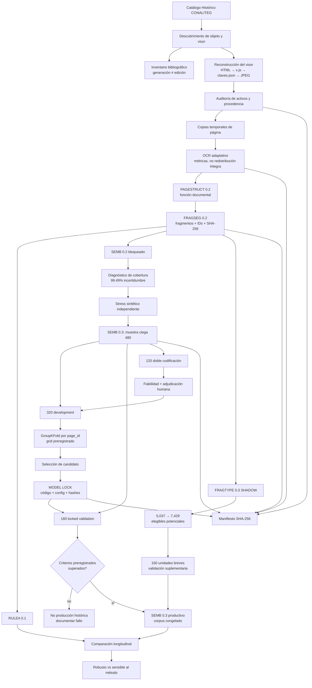

# Figura — Pipeline y stage gates de LTMD 0.1

Esta figura es la fuente canónica en Mermaid para el diagrama metodológico del artículo. Puede exportarse posteriormente a SVG/PDF para la revista sin redibujar la lógica.

## Lectura de la figura

La figura distingue tres ideas que deben conservarse en cualquier versión gráfica:

1. **procedencia y estructura preceden a la semántica**;
2. el fracaso de SEMB 0.2 no se borra: funciona como antecedente que justifica el nuevo stage gate humano;
3. los 160 casos de validación permanecen aislados hasta que existe un `MODEL LOCK`.

## Convenciones para versión editorial

- Las cajas de fuente/procedencia deben diferenciarse visualmente de las de inferencia semántica.
- El camino `no` de la validación debe permanecer visible; no dibujar un pipeline que presuponga éxito.
- `FRAGTYPE 0.3 SHADOW` se muestra como rama de corrección de constructo, no como reemplazo retroactivo de FRAGSEG 0.2.
- El manifiesto de integridad debe aparecer como capa transversal.
